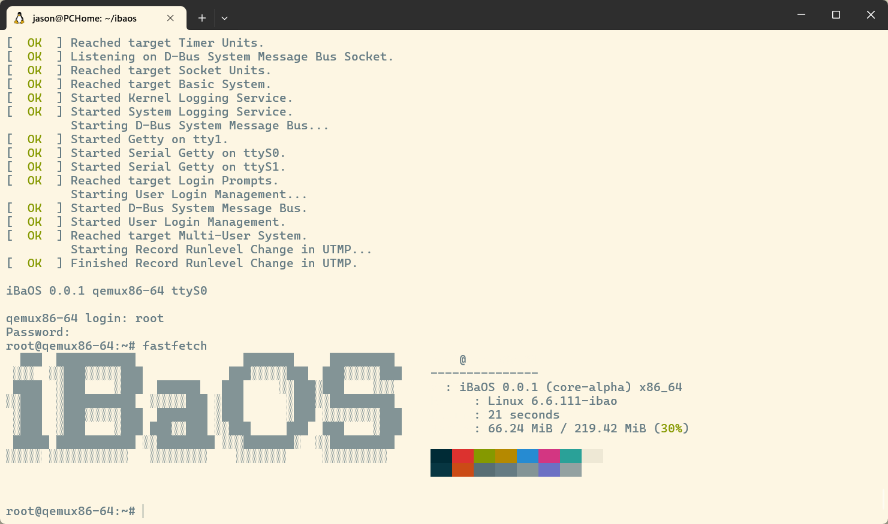

# DISTRO

打包生成 AIBAOS

## 编译

1. 获取源码：`git clone https://github.com/aibaos/distro-aibaos.git`
2. 进入目录：`cd distro-aibaos`
3. 编译：`kas build kas.yml`
    - （可选）指定build目录`export KAS_WORK_DIR=build`
4. 运行：`kas shell kas.yml -c 'runqemu nographic'`

  

